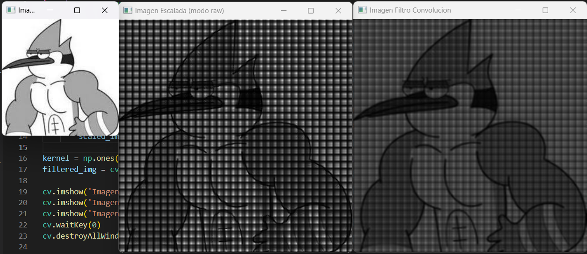

# Actividad Filtro de Convolución

## Instrucciones
*Genera una imagen escalada sin rellenar espacios y aplica un filtro de convolución con una matriz de 1/9.*

### Código
```python
import cv2 as cv
import numpy as np

img = cv.imread('mordecai.jpeg', 0)

x, y = img.shape  

scale_x, scale_y = 2, 2

scaled_img = np.zeros((int(x * scale_y), int(y * scale_x)), dtype=np.uint8)

for i in range(x):
    for j in range(y):
        scaled_img[i * scale_y, j * scale_x] = img[i, j]
        
kernel = np.ones((3, 3), np.float32) / 9
filtered_img = cv.filter2D(scaled_img, -1, kernel)

cv.imshow('Imagen Original', img)
cv.imshow('Imagen Escalada (modo raw)', scaled_img)
cv.imshow('Imagen Filtro Convolucion', filtered_img)
cv.waitKey(0)
cv.destroyAllWindows()
```

### Resultados
