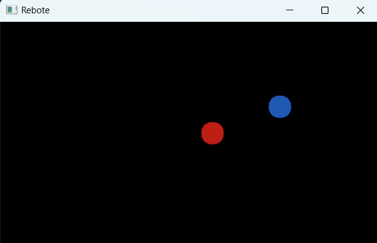
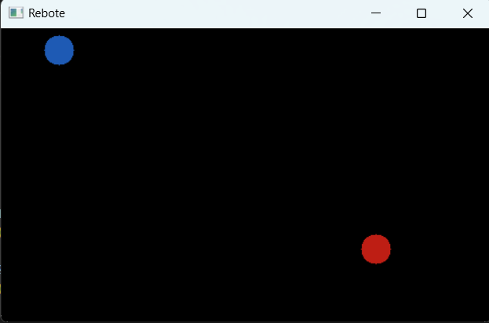

# Actividad 10

## Instrucciones
*Genera un efecto en una pelotita para que rebote en los bordes de un área. Cada que rebote debe cambiar su dirección.*

### Código
```python
import numpy as np
import cv2

ancho, alto = 500, 300  
radio1 = 15  
radio2 = 15  
color1 = (20, 30, 190) 
color2 = (180, 90, 30)  

# Velocidades y direcciones 1
x_velocidad_1 = np.random.choice([-6, 6])  
y_velocidad_1 = np.random.choice([-6, 6])  

#Velocidades y direcciones 2
x_velocidad_2 = np.random.choice([-10, 10])  
y_velocidad_2 = np.random.choice([-10, 10])  

# Posiciones iniciales
x_posicion_1 = np.random.randint(radio1, ancho - radio1)
y_posicion_1 = np.random.randint(radio1, alto - radio1)

x_posicion_2 = np.random.randint(radio2, ancho - radio2)
y_posicion_2 = np.random.randint(radio2, alto - radio2)

# Función para aplicar traslación
def traslacion(x, y, tx, ty):
    return x + tx, y + ty

# Función para evitar colisión
def distancia(x1, y1, x2, y2):
    return np.sqrt((x2 - x1)**2 + (y2 - y1)**2)

while True:
    img = np.ones((alto, ancho, 3), dtype=np.uint8) * 0

    #Dibujos 
    cv2.circle(img, (x_posicion_1, y_posicion_1), radio1, color1, -1)
    cv2.circle(img, (x_posicion_2, y_posicion_2), radio2, color2, -1)

    cv2.imshow("Rebote", img)

    # Traslación aplicada a 1
    x_posicion_1, y_posicion_1 = traslacion(x_posicion_1, y_posicion_1, x_velocidad_1, y_velocidad_1)

    # Traslación aplicada a 2
    x_posicion_2, y_posicion_2 = traslacion(x_posicion_2, y_posicion_2, x_velocidad_2, y_velocidad_2)

    # Evitar colisión
    if distancia(x_posicion_1, y_posicion_1, x_posicion_2, y_posicion_2) <= (radio1 + radio2):
        x_velocidad_2 = -x_velocidad_2
        y_velocidad_2 = -y_velocidad_2

    # Cambio de dirección en bordes
    if x_posicion_1 + radio1 >= ancho or x_posicion_1 - radio1 <= 0:
        x_velocidad_1 = -x_velocidad_1  
    if y_posicion_1 + radio1 >= alto or y_posicion_1 - radio1 <= 0:
        y_velocidad_1 = -y_velocidad_1  

    if x_posicion_2 + radio2 >= ancho or x_posicion_2 - radio2 <= 0:
        x_velocidad_2 = -x_velocidad_2 
    if y_posicion_2 + radio2 >= alto or y_posicion_2 - radio2 <= 0:
        y_velocidad_2 = -y_velocidad_2  

    # Salir del bucle si se presiona la tecla 'q'
    if cv2.waitKey(30) & 0xFF == ord('q'):
        break

cv2.destroyAllWindows()
```

### Resultados

