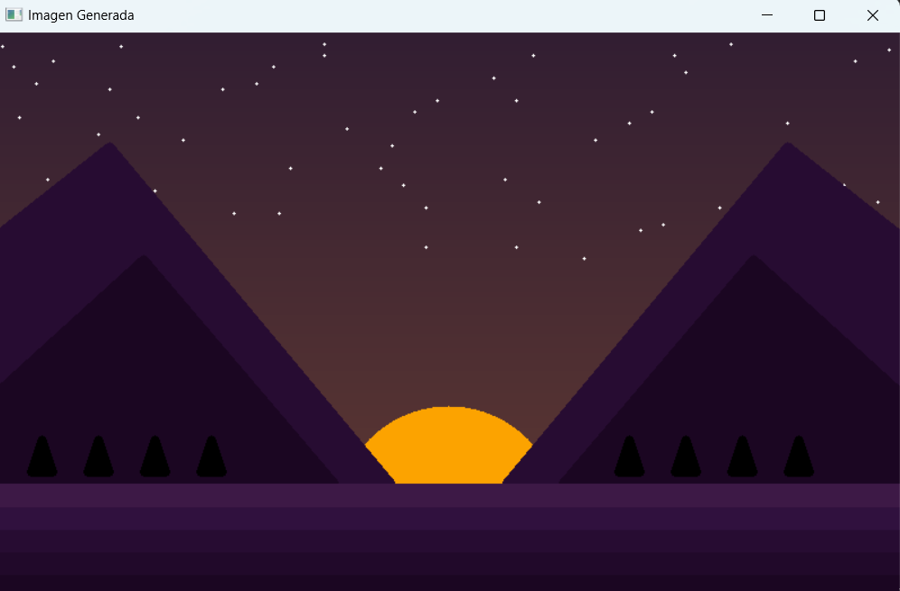

# Actividad 5

## Instrucciones

*Crear un dibujo mediante primitivas de dibujo utilizando OpenCV.*

```python
import cv2 as cv
import numpy as np

width, height = 800, 500
image = np.zeros((height, width, 3), dtype=np.uint8)

# Gradiente de cielo 
for i in range(height):
    color = (50, 30 * (height + i) // height, 50 * (height + i) // height)
    cv.line(image, (0, i), (width, i), color, 1)

#Sol
for i in range(100):  
    # Calcular el color del degradado
    color = (0, 165 * (i / 100), 255 * (i / 100))
    cv.circle(image, (800 // 2, (500 // 2)+180), i, color, -1)

#Estrellas
color = (255, 255, 255)
cv.circle(image, (5,12), 1, color, -1)
cv.circle(image, (15, 30), 1, color, -1)
cv.circle(image, (200, 50), 1, color, -1)
cv.circle(image, (350, 100), 1, color, -1)
cv.circle(image, (480, 150), 1, color, -1)
cv.circle(image, (600, 20), 1, color, -1)
cv.circle(image, (720, 180), 1, color, -1)
cv.circle(image, (50, 25), 1, color, -1)
cv.circle(image, (125, 75), 1, color, -1)
cv.circle(image, (260, 120), 1, color, -1)
cv.circle(image, (390, 60), 1, color, -1)
cv.circle(image, (520, 200), 1, color, -1)
cv.circle(image, (610, 35), 1, color, -1)
cv.circle(image, (730, 170), 1, color, -1)
cv.circle(image, (90, 90), 1, color, -1)
cv.circle(image, (140, 140), 1, color, -1)
cv.circle(image, (290, 10), 1, color, -1)
cv.circle(image, (380, 190), 1, color, -1)
cv.circle(image, (450, 130), 1, color, -1)
cv.circle(image, (560, 80), 1, color, -1)
cv.circle(image, (650, 10), 1, color, -1)
cv.circle(image, (780, 150), 1, color, -1)
cv.circle(image, (35, 45), 1, color, -1)
cv.circle(image, (165, 95), 1, color, -1)
cv.circle(image, (245, 30), 1, color, -1)
cv.circle(image, (360, 135), 1, color, -1)
cv.circle(image, (475, 20), 1, color, -1)
cv.circle(image, (590, 170), 1, color, -1)
cv.circle(image, (700, 80), 1, color, -1)
cv.circle(image, (30, 160), 1, color, -1)
cv.circle(image, (110, 12), 1, color, -1)
cv.circle(image, (230, 45), 1, color, -1)
cv.circle(image, (340, 120), 1, color, -1)
cv.circle(image, (460, 190), 1, color, -1)
cv.circle(image, (580, 70), 1, color, -1)
cv.circle(image, (650, 200), 1, color, -1)
cv.circle(image, (760, 25), 1, color, -1)
cv.circle(image, (85, 140), 1, color, -1)
cv.circle(image, (150, 180), 1, color, -1)
cv.circle(image, (210, 160), 1, color, -1)
cv.circle(image, (310, 85), 1, color, -1)
cv.circle(image, (440, 40), 1, color, -1)
cv.circle(image, (530, 95), 1, color, -1)
cv.circle(image, (640, 155), 1, color, -1)
cv.circle(image, (750, 135), 1, color, -1)
cv.circle(image, (20, 75), 1, color, -1)
cv.circle(image, (100, 50), 1, color, -1)
cv.circle(image, (290, 20), 1, color, -1)
cv.circle(image, (380, 155), 1, color, -1)
cv.circle(image, (460, 60), 1, color, -1)
cv.circle(image, (570, 175), 1, color, -1)
cv.circle(image, (680, 190), 1, color, -1)
cv.circle(image, (790, 15), 1, color, -1)
cv.circle(image, (45, 130), 1, color, -1)
cv.circle(image, (135, 180), 1, color, -1)
cv.circle(image, (250, 160), 1, color, -1)
cv.circle(image, (370, 70), 1, color, -1)

#Montañas 
#Izquierda fondo
pts = np.array([[-280, 400], [100, 100], [350, 400]], np.int32)
pts = pts.reshape((-1, 1, 2))

cv.polylines(image, [pts], isClosed=True, color=(50, 12, 39), thickness=5)
cv.fillPoly(image, [pts], color=(50, 12, 39))

#Izquierda frente
pts = np.array([[-90, 400], [130, 200], [300, 400]], np.int32)
pts = pts.reshape((-1, 1, 2))

cv.polylines(image, [pts], isClosed=True, color=(34,6,27), thickness=5)
cv.fillPoly(image, [pts], color=(34,6,27))

#Derecha fondo
pts = np.array([[1080, 400], [700, 100], [450, 400]], np.int32)  # Invertimos los puntos horizontales
pts = pts.reshape((-1, 1, 2))

cv.polylines(image, [pts], isClosed=True, color=(50, 12, 39), thickness=5)
cv.fillPoly(image, [pts], color=(50, 12, 39))

#Derecha frente
pts = np.array([[500, 400], [670, 200], [890, 400]], np.int32)
pts = pts.reshape((-1, 1, 2))

cv.polylines(image, [pts], isClosed=True, color=(34,6,27), thickness=5)
cv.fillPoly(image, [pts], color=(34,6,27))

#Árboles
pts = np.array([[30, 390], [40, 360], [50, 390]], np.int32)
pts = pts.reshape((-1, 1, 2))

cv.polylines(image, [pts], isClosed=True, color=(0,0,0), thickness=5)
cv.fillPoly(image, [pts], color=(0,0,0))

pts = np.array([[80, 390], [90, 360], [100, 390]], np.int32)
pts = pts.reshape((-1, 1, 2))

cv.polylines(image, [pts], isClosed=True, color=(0,0,0), thickness=5)
cv.fillPoly(image, [pts], color=(0,0,0))

pts = np.array([[130, 390], [140, 360], [150, 390]], np.int32)
pts = pts.reshape((-1, 1, 2))

cv.polylines(image, [pts], isClosed=True, color=(0,0,0), thickness=5)
cv.fillPoly(image, [pts], color=(0,0,0))

pts = np.array([[180, 390], [190, 360], [200, 390]], np.int32)
pts = pts.reshape((-1, 1, 2))

cv.polylines(image, [pts], isClosed=True, color=(0,0,0), thickness=5)
cv.fillPoly(image, [pts], color=(0,0,0))

pts = np.array([[700, 390], [710, 360], [720, 390]], np.int32)
pts = pts.reshape((-1, 1, 2))

cv.polylines(image, [pts], isClosed=True, color=(0,0,0), thickness=5)
cv.fillPoly(image, [pts], color=(0,0,0))

pts = np.array([[650, 390], [660, 360], [670, 390]], np.int32)
pts = pts.reshape((-1, 1, 2))

cv.polylines(image, [pts], isClosed=True, color=(0,0,0), thickness=5)
cv.fillPoly(image, [pts], color=(0,0,0))

pts = np.array([[600, 390], [610, 360], [620, 390]], np.int32)
pts = pts.reshape((-1, 1, 2))

cv.polylines(image, [pts], isClosed=True, color=(0,0,0), thickness=5)
cv.fillPoly(image, [pts], color=(0,0,0))

pts = np.array([[550, 390], [560, 360], [570, 390]], np.int32)
pts = pts.reshape((-1, 1, 2))

cv.polylines(image, [pts], isClosed=True, color=(0,0,0), thickness=5)
cv.fillPoly(image, [pts], color=(0,0,0))
  
#Suelo por fragmentos    
cv.line(image, (0, height - 10), (width, height - 10), (34, 6, 27), 20)
cv.line(image, (0, height - 30), (width, height - 30), (42, 9, 33), 20)
cv.line(image, (0, height - 50), (width, height - 50), (50, 12, 39), 20)
cv.line(image, (0, height - 70), (width, height - 70), (62, 17, 48), 20)
cv.line(image, (0, height - 90), (width, height - 90), (70, 25, 61), 20)

cv.imshow('Imagen Generada', image)
cv.waitKey(0)
cv.destroyAllWindows()
```

**Imagen generada**
