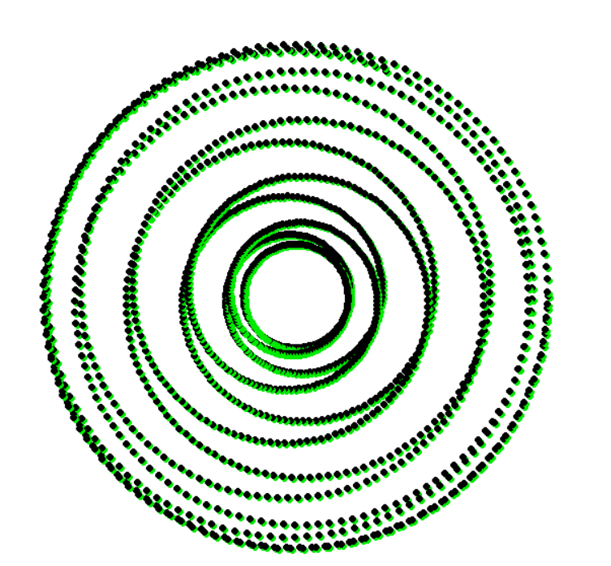
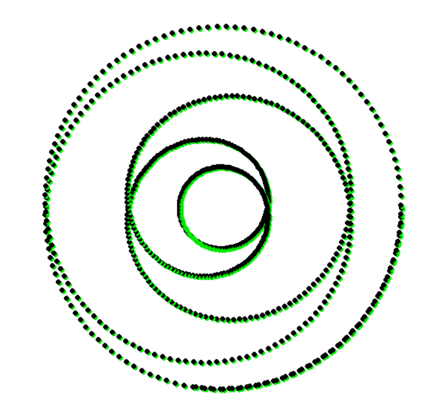
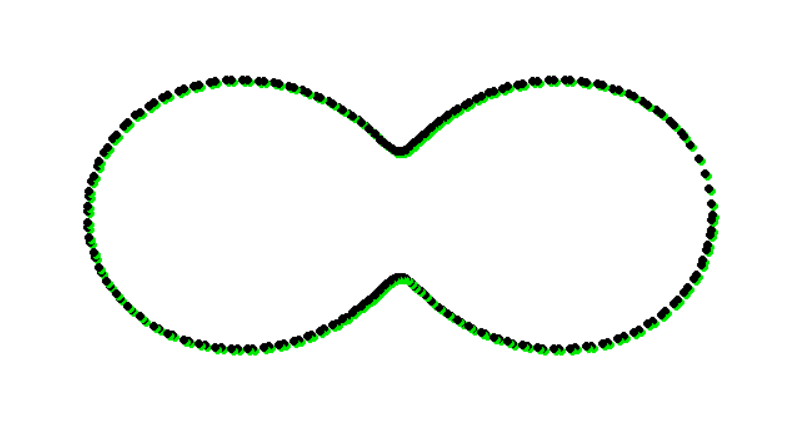
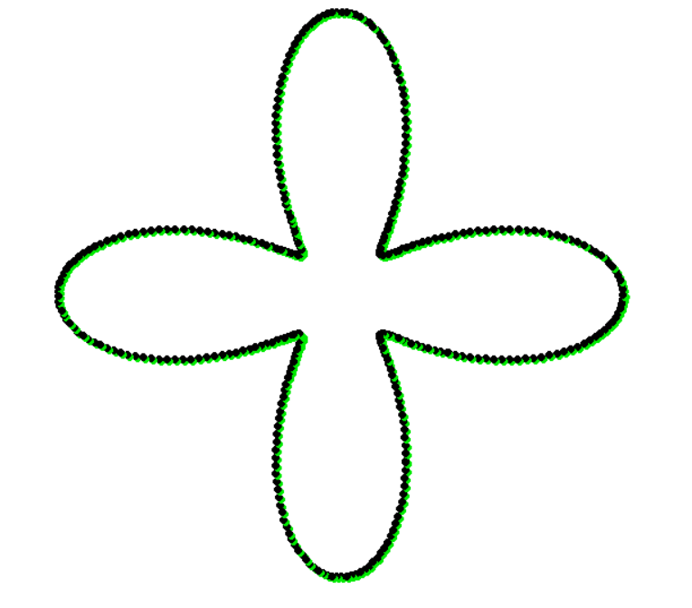
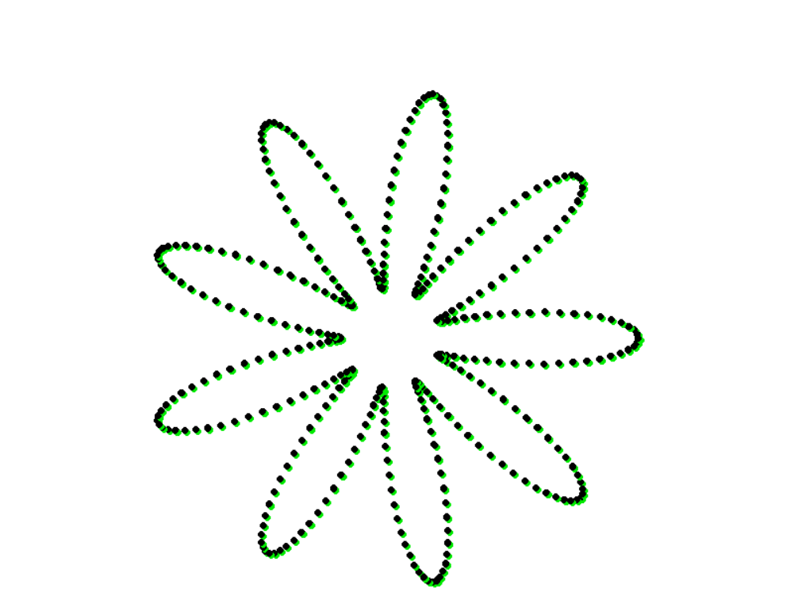
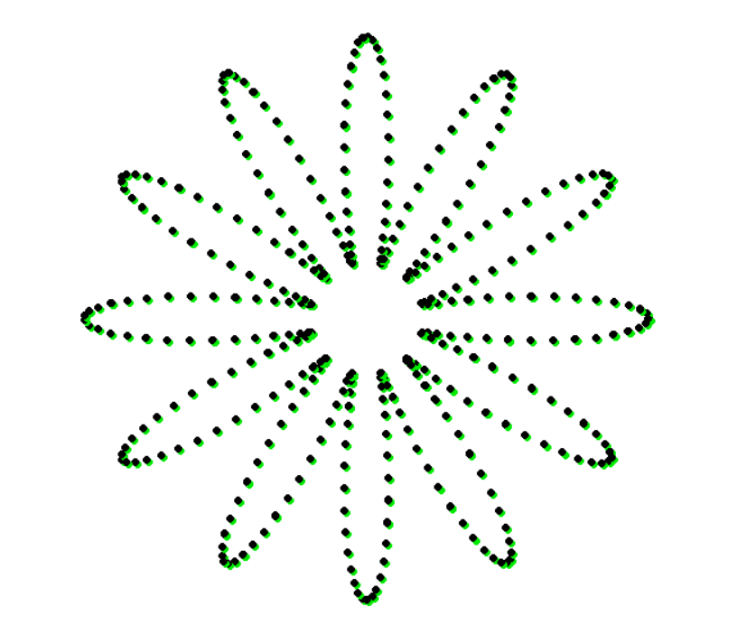
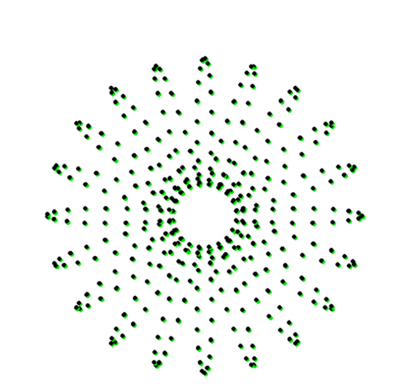
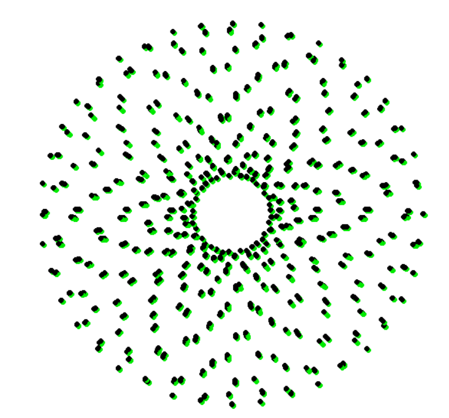
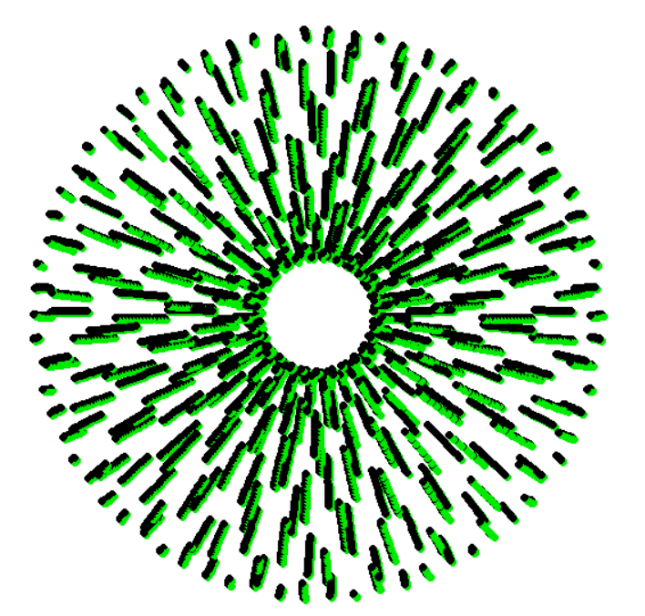
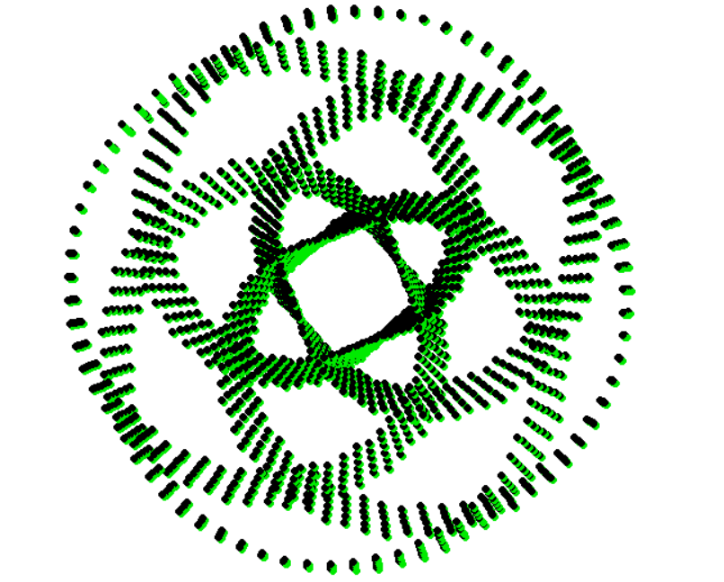

# Actividad 6

## Instrucciones

*Programar al menos 10 ecuaciones paramétricas.*

### Código base

```python
import numpy as np
import cv2

# Definir los parámetros iniciales
anch, alt = 1000, 1000  # Tamaño de la ventana
img = np.ones((alt, anch, 3), dtype=np.uint8) * 255

# Parámetros para la curva
a, b, c = 10, 30, 25  # Valores para la ecuación paramétrica
d,e,f = 1, 16, 1
incr_angulo = 0.05  # Incremento del ángulo
max_theta = 2 * np.pi  # Un ciclo completo

# Centro de la imagen
cent_x, cent_y = anch // 2, alt // 2
escala = 200  # Factor de escala para ampliar la curva

theta = 0  # Ángulo inicial

while True:  # Bucle infinito
    # Limpiar la imagen
    img = np.ones((alt, anch, 3), dtype=np.uint8) * 255
    
    # Dibujar la curva completa desde 0 hasta theta
    """   for t in np.arange(0, theta, theta_increment):
        # Calcular las coordenadas paramétricas (x, y)
        x = int(center_x + scale * (np.cos(a * t) + (np.cos(b * t) / 2) + (np.sin(c * t) / 3)))
        y = int(center_y + scale * (np.sin(a * t) + (np.sin(b * t) / 2) + (np.cos(c * t) / 3)))
        
        # Dibujar un círculo en la posición calculada
        cv2.circle(img, (x, y), 2, (0, 234, 0), 2) 
        cv2.circle(img, (x-2, y-2), 2, (0, 0, 0), 2) """
        
    for t in np.arange(0, theta, incr_angulo):
        # Calcular las coordenadas paramétricas (x, y)
        x = int(cent_x + escala * (np.cos(d * t) + (np.cos(e * t) / 2) + (np.sin(f * t) / 3)))
        y = int(cent_y + escala * (np.sin(d * t) + (np.sin(e * t) / 2) + (np.cos(f * t) / 3)))
        
        # Dibujar un círculo en la posición calculada
        cv2.circle(img, (x, y), 2, (50, 0, 234), 2)
        cv2.circle(img, (x-1, y-1), 2, (0, 0, 0), 2) 
        

    # Mostrar la imagen
    cv2.imshow("Animación Paramétrica", img)
    
    # Incrementar el ángulo
    theta += incr_angulo


    # Pausar para ver la animación
    if cv2.waitKey(30) & 0xFF == 27:  # Esperar 30ms, salir con 'ESC'
        break

# Cerrar la ventana al finalizar
cv2.destroyAllWindows()
```

### Resultados

**Imagen 1**


**Imagen 2**


**Imagen 3**


**Imagen 4**


**Imagen 5**


**Imagen 6**


**Imagen 7**


**Imagen 8**


**Imagen 9**


**Imagen 10**



### Extras

**Imagen 1**


**Imagen 2**
