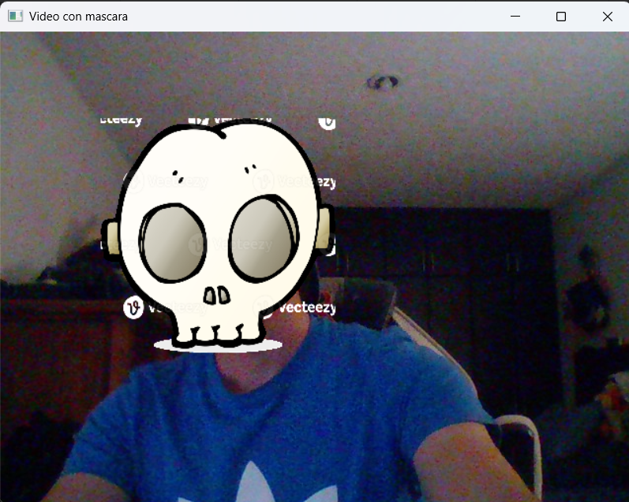
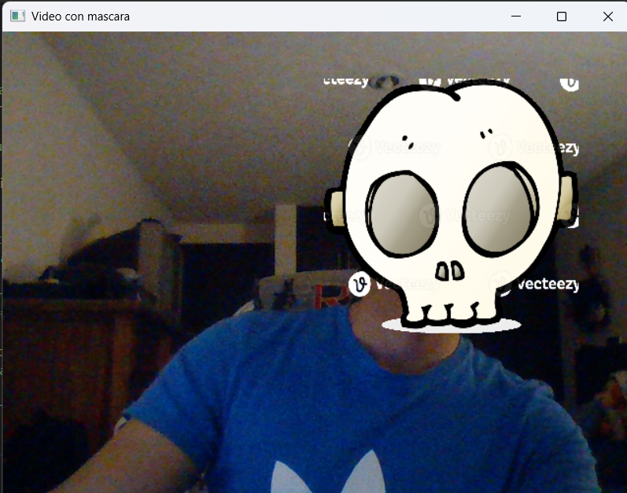

# Actividad Filtro con Seguimiento

## Instrucciones
*Utiliza los Haarcascades para que una figura se posicione en un lugar concreto del rostro.*

### Código
```python
import cv2
import numpy as np

# Cargar la máscara que deseas agregar 
mascara = cv2.imread('calaverita.webp', cv2.IMREAD_UNCHANGED)  

# Verificar si la imagen tiene un canal alfa
if mascara.shape[2] != 4:
    print("Error: La imagen no tiene canal alfa.")
    exit()

# Cargar el clasificador preentrenado de rostros
face_cascade = cv2.CascadeClassifier('haarcascade_frontalface_alt2.xml')

# Capturar video desde la cámara (o puedes usar un archivo de video)
video = cv2.VideoCapture(0)  # Cambia el 0 por la ruta de un archivo de video si quieres usar un archivo

# Factor de escala para agrandar la máscara
factor_escala = 1.6  # Puedes ajustar este valor para cambiar el tamaño de la máscara

# Desplazamiento en píxeles hacia arriba
desplazamiento_vertical = 10  # Ajusta este valor según necesites

while True:
    # Leer cada frame del video
    ret, frame = video.read()

    if not ret:
        break

    # Convertir el frame a escala de grises
    frame_gris = cv2.cvtColor(frame, cv2.COLOR_BGR2GRAY)

    # Detectar los rostros en el frame
    rostros = face_cascade.detectMultiScale(frame_gris, scaleFactor=1.1, minNeighbors=5, minSize=(30, 30))

    # Procesar cada rostro detectado
    for (x, y, w, h) in rostros:
        # Calcular las nuevas dimensiones de la máscara según el factor de escala
        nuevo_ancho = int(w * factor_escala)
        nuevo_alto = int(h * factor_escala)

        # Redimensionar la máscara para que sea más grande o más pequeña según el factor de escala
        mascara_redimensionada = cv2.resize(mascara, (nuevo_ancho, nuevo_alto))

        # Separar los canales de la máscara: color y alfa (transparencia)
        mascara_rgb = mascara_redimensionada[:, :, :3]  # Canal de color
        mascara_alpha = mascara_redimensionada[:, :, 3]  # Canal de transparencia

        # Ajustar las coordenadas (x, y) para centrar la máscara sobre el rostro
        x_offset = x - (nuevo_ancho - w) // 2
        y_offset = y - (nuevo_alto - h) // 2 - desplazamiento_vertical  # Desplazar 50 píxeles hacia arriba

        # Asegurarse de que las coordenadas estén dentro del marco
        if y_offset < 0:
            y_offset = 0

        # Crear una región de interés (ROI) en el frame donde colocaremos la máscara
        roi = frame[y_offset:y_offset+nuevo_alto, x_offset:x_offset+nuevo_ancho]

        # Invertir la máscara alfa para obtener la parte del rostro donde se aplicará la máscara
        mascara_alpha_inv = cv2.bitwise_not(mascara_alpha)

        # Enmascarar la región del rostro en la imagen original
        fondo = cv2.bitwise_and(roi, roi, mask=mascara_alpha_inv)

        # Enmascarar la máscara RGB
        mascara_fg = cv2.bitwise_and(mascara_rgb, mascara_rgb, mask=mascara_alpha)

        # Combinar el fondo (parte del rostro sin máscara) y la parte con la máscara
        resultado = cv2.add(fondo, mascara_fg)

        # Reemplazar la región del rostro con la imagen combinada
        frame[y_offset:y_offset+nuevo_alto, x_offset:x_offset+nuevo_ancho] = resultado

    # Mostrar el frame con la máscara aplicada
    cv2.imshow('Video con mascara', frame)

    # Presionar 'q' para salir del loop
    if cv2.waitKey(1) & 0xFF == ord('q'):
        break

# Liberar la captura de video y cerrar las ventanas
video.release()
cv2.destroyAllWindows()
```

### Resultados




No hallaba ninguna imagen que pudiese usar como máscara y que sí me convenciera, me disculpo.