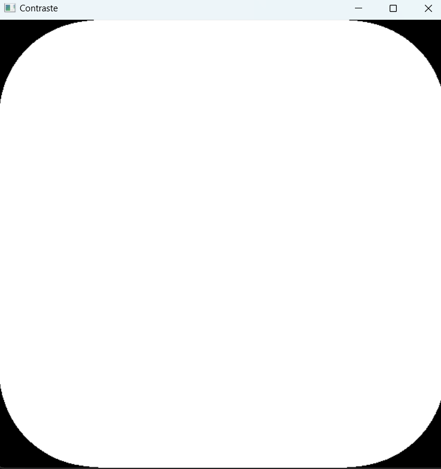

# Actividad 2

## Instrucciones

*Generar al menos cinco operadores puntuales utilizando la imagen generada o una imagen previamente cargada.*

### Imagen base


### Imagen base trabajada


**Código 1**
```python
import cv2 as cv

img = cv.imread('tr.png', 0)
cv.imshow('salida', img)
x, y = img.shape
for i in range (x):
    for j in range (y):
        if(img[i,j]>150):
            img[i,j]=255
        else:
            img[i,j]=0
            
        
        #img[i,j]=255-img[i,j]
        
cv.imshow('negativo', img)
print(img.shape, x, y)
cv.waitKey(0)
cv.destroyAllWindows()
```
**Primer resultado**


**Código 2**
```python
import cv2 as cv

img = cv.imread('tr.png', 0)
cv.imshow('salida', img)
x, y = img.shape
for i in range(x):
    for j in range(y):
        if img[i, j] > 200:  
            img[i, j] = 255
        else:  
            img[i, j] = 0

cv.imshow('Blanco y negro', img)
print(img.shape, x, y)
cv.waitKey(0)
cv.destroyAllWindows()
```

**Segundo resultado**


**Código 3**
```python
import cv2 as cv

img = cv.imread('tr.png', 0)
cv.imshow('salida', img)
x, y = img.shape
for i in range(x):
    for j in range(y):
        if img[i, j] > 100:  
            img[i, j] = 255
        else:  
            img[i, j] = 0

cv.imshow('Contraste', img)
print(img.shape, x, y)
cv.waitKey(0)
cv.destroyAllWindows()
```

**Tercer resultado**


**Código 4**
```python
import cv2 as cv

img = cv.imread('tr.png', 0)
cv.imshow('salida', img)
x, y = img.shape
for i in range(x):
    for j in range(y):
        if img[i, j] > 150: 
            img[i, j] = 255
        elif img[i, j] < 50:  
            img[i, j] = 0
        else:  
            img[i, j] = 128

cv.imshow('Inversion a medias', img)
print(img.shape, x, y)
cv.waitKey(0)
cv.destroyAllWindows()
```

**Cuarto resultado**


**Código 5**
```python
import cv2 as cv

img = cv.imread('tr.png', 0)
cv.imshow('salida', img)
x, y = img.shape
for i in range(x):
    for j in range(y):
        if img[i, j] < 100: 
            img[i, j] = 255  
        elif img[i, j] < 200: 
            img[i, j] = img[i, j] + 50 
            img[i, j] = min(img[i, j], 255)  
        else: 
            img[i, j] = 200  

cv.imshow('Fantasma', img)
print(img.shape, x, y)
cv.waitKey(0)
cv.destroyAllWindows()
```

**Quinto resultado**
