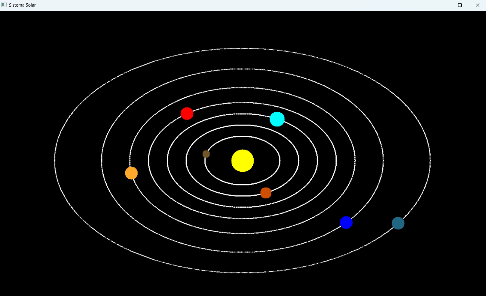

# Actividad 7

## Instrucciones

*Genera una animación de sistema solar utilizando trayectorias elípticas respecto al centro.*

### Código
```python
import numpy as np
import cv2 as cv

def punto_orbita(a, b, t, centro):
    x = int(a * np.cos(t) + centro[0])  # Desplazamiento a la posición del sol
    y = int(b * np.sin(t) + centro[1])
    return (x, y)

# Dimensiones de la imagen
ancho, alto = 1300, 1000

imagen = np.zeros((alto, ancho, 3), dtype=np.uint8)

# Parámetros del sistema solar
centro_sol = (650, 400)  
planetas = [
    {'a': 100, 'b': 65, 'radio': 10, 'color': (42, 85, 115), 'velocidad': 30},  # Mercurio 
    {'a': 150, 'b': 95, 'radio': 15, 'color': (4, 78,207), 'velocidad': 10}, # Venus 
    {'a': 200, 'b': 125, 'radio': 20, 'color': (255, 255, 0), 'velocidad': 7},  # Tierra 
    {'a': 250, 'b': 155, 'radio': 17, 'color': (0, 0, 255), 'velocidad': 5.5}, # Marte 
    {'a': 300, 'b': 195, 'radio': 17, 'color': (44, 169, 255), 'velocidad': 4}, # Jupiter 
    {'a': 375, 'b': 245, 'radio': 17, 'color': (255, 0, 0), 'velocidad': 1}, # Urano 
    {'a': 500, 'b': 300, 'radio': 17, 'color': (131, 103, 33), 'velocidad': .8}, # Neptuno 
]
num_puntos = 1000

# Valores por planeta
t_vals = np.linspace(0, 2 * np.pi, num_puntos)

# Animación
for t in t_vals:
    # Imagen por iteración
    imagen = np.zeros((alto, ancho, 3), dtype=np.uint8)
    
    cv.circle(imagen, centro_sol, radius=30, color=(0, 255, 255), thickness=-1)
    
    # Órbitas de todos los planetas
    for planeta in planetas:
        for t_tray in t_vals:
            pt_tray = punto_orbita(planeta['a'], planeta['b'], t_tray, centro_sol)
            cv.circle(imagen, pt_tray, radius=1, color=(255, 255, 255), thickness=-1)
    
    # Planetas posición actual
    for planeta in planetas:
        punto = punto_orbita(planeta['a'], planeta['b'], t * planeta['velocidad'], centro_sol)
        cv.circle(imagen, punto, radius=planeta['radio'], color=planeta['color'], thickness=-1)
    
    # Mostrar la imagen con los planetas en movimiento
    cv.imshow('Sistema Solar', imagen)
    
    if cv.waitKey(10) & 0xFF == ord('q'):
        break
    
cv.destroyAllWindows()
```
### Resultado


*Cabe resaltar que* **ES UNA ANIMACIÓN** 
