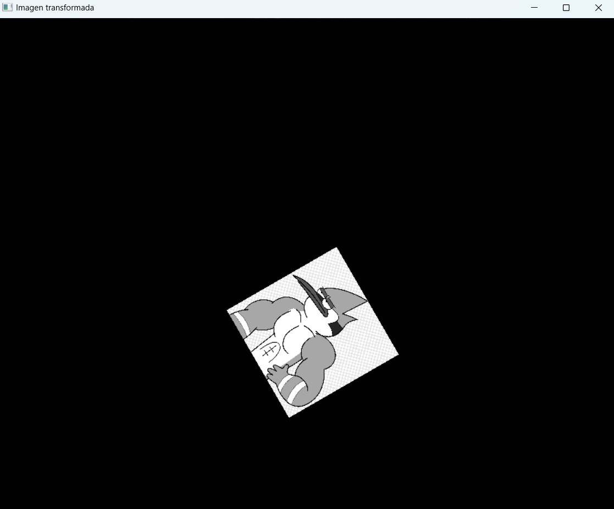

# Actividad 3

## Instrucciones

*Aplicar las transformaciones geométricas vistas en clase.*

**Problema 1**

```python
import cv2 as cv
import numpy as np
import math

img = cv.imread('mordecool.png', 0)

y, x = img.shape[:2]

# Parámetros de transformación
theta = math.radians(60)
escala = 1/5
tx, ty = 10, 0  # Traslación 

# Centro
cx, cy = x // 2, y // 2

# Imagen en blanco para el resultado
img_transformada = np.zeros((y, x), dtype=np.uint8)

for j in range(y):
    for i in range(x):
        # Nuevo origen
        new_x = i - cx
        new_y = j - cy
        
        # Transformación
        i_rotado = (new_x * math.cos(theta) - new_y * math.sin(theta)) * escala + cx + tx
        j_rotado = (new_x * math.sin(theta) + new_y * math.cos(theta)) * escala + cy + ty
        
        if 0 <= i_rotado < x and 0 <= j_rotado < y:
            img_transformada[int(j_rotado), int(i_rotado)] = img[j, i]

cv.imshow('Imagen transformada', img_transformada)
cv.waitKey(0)
cv.destroyAllWindows()
```




**Problema 2**

```python
import cv2 as cv
import numpy as np
import math

img = cv.imread('si.jpg', 0)

y, x = img.shape[:2]

# Parámetros de transformación
theta = math.radians(30)
escala = 2

# Centro
cx, cy = x // 2, y // 2

# Imagen en blanco para el resultado
img_transformada = np.zeros((y, x), dtype=np.uint8)

for j in range(y):
    for i in range(x):
        # Nuevo origen
        new_x = i - cx
        new_y = j - cy
        
        # Transformación
        i_rotado = (new_x * math.cos(theta) + new_y * math.sin(theta)) * escala
        j_rotado = (-new_x * math.sin(theta) + new_y * math.cos(theta)) * escala
        
        # Límites
        i_final = int(i_rotado + cx)
        j_final = int(j_rotado + cy)
        
        if 0 <= i_final < x and 0 <= j_final < y:
            img_transformada[j_final, i_final] = img[j, i]

cv.imshow('Imagen transformada', img_transformada)
cv.waitKey(0)
cv.destroyAllWindows()
```


**Problema 3**

```python
import cv2 as cv
import numpy as np
import math

img = cv.imread('ser.jpg', 0)

y, x = img.shape[:2]

# Parámetros de transformación
theta = math.radians(70)
escala = 2
tx, ty = 20, 20  # Traslación 

# Centro
cx, cy = x // 2, y // 2

# Imagen en blanco para el resultado
img_transformada = np.zeros((y, x), dtype=np.uint8)

for j in range(y):
    for i in range(x):
        # Nuevo origen
        new_x = i - cx
        new_y = j - cy
        
        # Transformación
        i_rotado = (new_x * math.cos(theta) - new_y * math.sin(theta)) * escala + cx + tx
        j_rotado = (new_x * math.sin(theta) + new_y * math.cos(theta)) * escala + cy + ty
        
        if 0 <= i_rotado < x and 0 <= j_rotado < y:
            img_transformada[int(j_rotado), int(i_rotado)] = img[j, i]

cv.imshow('Imagen transformada', img_transformada)
cv.waitKey(0)
cv.destroyAllWindows()
```


### Trabajo a mano

**Ejercicio 1**


**Ejercicio 2**


**Ejercicio 3**
