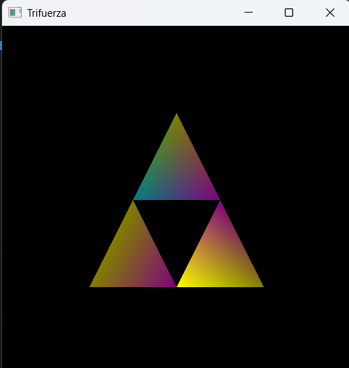

# Actividad con Figura OpenGL

## Instrucciones
*Utiliza OpenGL para modificar parámetros de color en una figura a partir de sus vértices*

### Código
```python
import glfw
from OpenGL.GL import (
    glClear, glClearColor, glBegin, glEnd, glVertex2f, glColor3f, GL_COLOR_BUFFER_BIT, GL_TRIANGLES
)

def main():
    # Inicializar GLFW
    if not glfw.init():
        return

    # Crear la ventana
    window = glfw.create_window(500, 500, "Trifuerza", None, None)
    if not window:
        glfw.terminate()
        return

    # Hacer el contexto de OpenGL actual
    glfw.make_context_current(window)

    # Establecer el color de fondo
    glClearColor(0.0, 0.0, 0.0, 1.0)

    # Bucle principal de renderizado
    while not glfw.window_should_close(window):
        # Limpiar la pantalla
        glClear(GL_COLOR_BUFFER_BIT)

        # Dibujar la Trifuerza
        glBegin(GL_TRIANGLES)

        # Triángulo superior
        glColor3f(0.5, 0.5, 0.0)  # Rojo
        glVertex2f(0.0, 0.5)       # Vértice superior
        glColor3f(0.0, 0.5, 0.5)  # Verde
        glVertex2f(-0.25, 0.0)    # Vértice inferior izquierdo
        glColor3f(0.5, 0.0, 0.5)  # Azul
        glVertex2f(0.25, 0.0)     # Vértice inferior derecho

        # Triángulo inferior izquierdo
        glColor3f(0.5, 0.5, 0.0)  # Rojo
        glVertex2f(-0.25, 0.0)    # Vértice superior
        glColor3f(0.5, 0.5, 0.0)  # Rojo
        glVertex2f(-0.5, -0.5)    # Vértice inferior izquierdo
        glColor3f(0.5, 0.0, 0.5)  # Azul
        glVertex2f(0.0, -0.5)     # Vértice inferior derecho

        # Triángulo inferior derecho
        glColor3f(0.5, 0.0, 0.5)  # Azul
        glVertex2f(0.25, 0.0)     # Vértice superior
        glColor3f(1.0, 1.0, 0.0)  # Amarillo
        glVertex2f(0.0, -0.5)     # Vértice inferior izquierdo
        glColor3f(0.5, 0.5, 0.0)  # Rojo
        glVertex2f(0.5, -0.5)     # Vértice inferior derecho

        glEnd()

        # Intercambiar buffers y procesar eventos
        glfw.swap_buffers(window)
        glfw.poll_events()

    # Terminar GLFW
    glfw.terminate()

if __name__ == "__main__":
    main()
```

### Resultados
