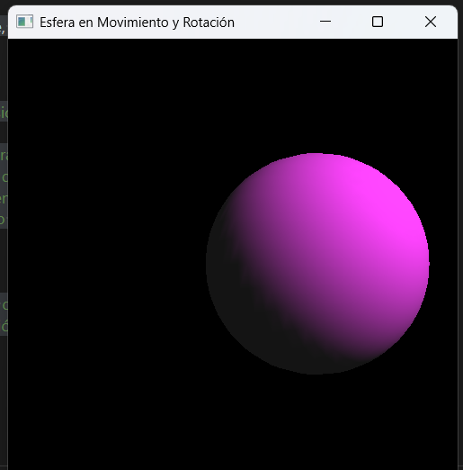
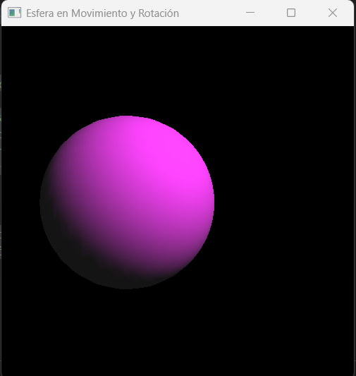

# Actividad pelota rebotando

## Instrucciones
*Utiliza OPENGL para crear una pelota que rebote en los bordes de la ventana*

### Código
```python
import glfw
from OpenGL.GL import *
from OpenGL.GLU import gluNewQuadric, gluSphere, gluPerspective
import sys
import math

# Variables globales para el ángulo de rotación y posición de la esfera
window = None
rotation_angle = 0.0  # Ángulo de rotación de la esfera
movement_offset = 0.0  # Offset para el movimiento de vaivén
movement_speed = 0.0005  # Velocidad del movimiento de vaivén
movement_direction = 1  # Dirección del movimiento (1 a la derecha, -1 a la izquierda)

def init():
    glClearColor(0.0, 0.0, 0.0, 1.0)  # Fondo negro
    glEnable(GL_DEPTH_TEST)            # Activar prueba de profundidad
    glEnable(GL_LIGHTING)              # Activar iluminación
    glEnable(GL_LIGHT0)                # Activar la luz 0

    # Configuración de la perspectiva
    glMatrixMode(GL_PROJECTION)
    gluPerspective(45, 1.0, 0.1, 50.0)
    glMatrixMode(GL_MODELVIEW)

    # Configuración de la luz
    light_pos = [1.0, 1.0, 1.0, 0.0]  # Posición de la luz
    light_color = [1.0, 1.0, 1.0, 1.0]  # Color de la luz blanca
    ambient_light = [0.2, 0.2, 0.2, 1.0]  # Luz ambiental

    glLightfv(GL_LIGHT0, GL_POSITION, light_pos)
    glLightfv(GL_LIGHT0, GL_DIFFUSE, light_color)
    glLightfv(GL_LIGHT0, GL_AMBIENT, ambient_light)

    # Configuración de las propiedades de material
    material_diffuse = [1, 0.2, 1.0, 0.0]  # Color difuso (azul claro)
    glMaterialfv(GL_FRONT, GL_DIFFUSE, material_diffuse)

def draw_sphere(radius=1, slices=32, stacks=32):
    global rotation_angle, movement_offset
    glClear(GL_COLOR_BUFFER_BIT | GL_DEPTH_BUFFER_BIT)
    glLoadIdentity()
    glTranslatef(movement_offset, 0.0, -5)      # Mover la esfera en vaivén
    glRotatef(rotation_angle, 0, 1, 0)  # Rotar la esfera sobre su eje Y

    quadric = gluNewQuadric()
    gluSphere(quadric, radius, slices, stacks)  # Dibujar la esfera

    glfw.swap_buffers(window)

def update_motion():
    global rotation_angle, movement_offset, movement_direction

    # Actualizar el ángulo de rotación
    rotation_angle += 1
    if rotation_angle >= 360:
        rotation_angle = 0  # Reiniciar el ángulo después de una vuelta completa

    # Actualizar el movimiento de vaivén
    movement_offset += movement_speed * movement_direction
    if movement_offset > 1.0:       # Limite derecho
        movement_direction = -1     # Cambiar dirección hacia la izquierda
    elif movement_offset < -1.0:    # Limite izquierdo
        movement_direction = 1      # Cambiar dirección hacia la derecha

def main():
    global window

    # Inicializar GLFW
    if not glfw.init():
        sys.exit()
    
    # Crear ventana de GLFW
    width, height = 500, 500
    window = glfw.create_window(width, height, "Esfera en Movimiento y Rotación", None, None)
    if not window:
        glfw.terminate()
        sys.exit()

    glfw.make_context_current(window)
    glViewport(0, 0, width, height)
    init()

    # Bucle principal
    while not glfw.window_should_close(window):
        draw_sphere()
        update_motion()  # Actualizar el movimiento y rotación
        glfw.poll_events()

    glfw.terminate()

if __name__ == "__main__":
    main()
```

### Resultados


