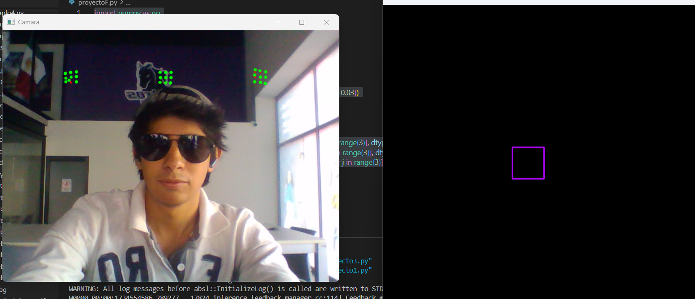
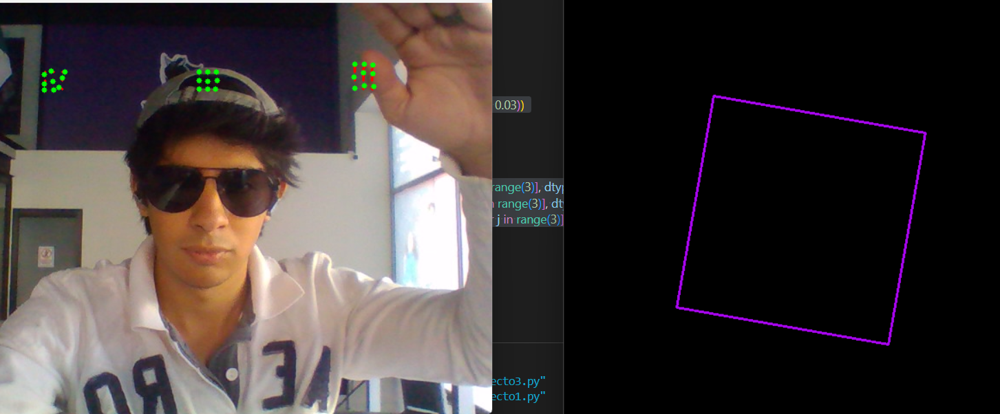
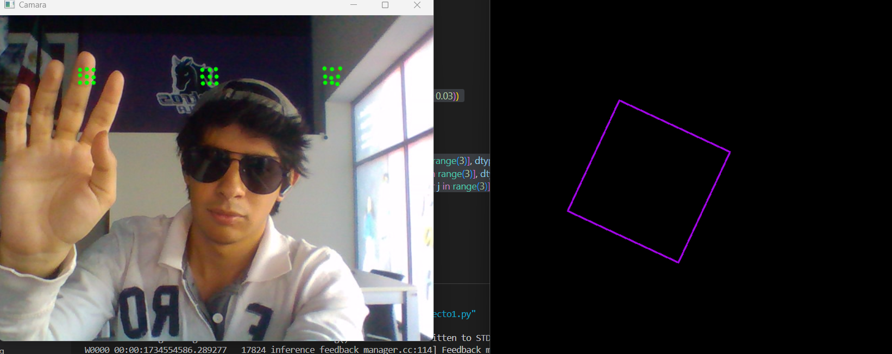
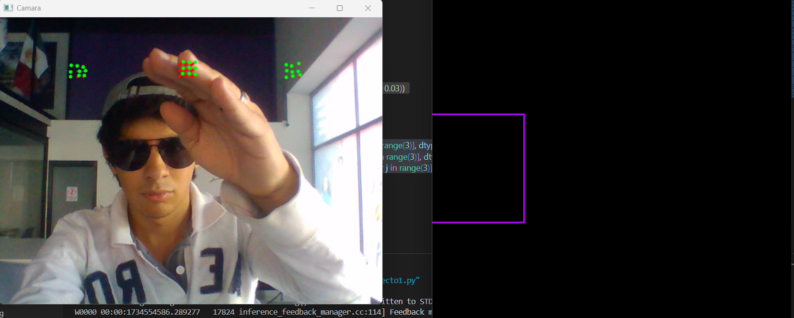

# Proyecto Final - Individual

## Instrucciones
*Utilizar flujo óptico para generar transofrmaciones en una figura geométrica*

### Código
```python
import numpy as np
import cv2 as cv
import math

cap = cv.VideoCapture(0)

# Parámetros para flujo óptico
lk_params = dict(winSize=(15, 15), maxLevel=2,
                 criteria=(cv.TERM_CRITERIA_EPS | cv.TERM_CRITERIA_COUNT, 10, 0.03))

_, vframe = cap.read()
vgris = cv.cvtColor(vframe, cv.COLOR_BGR2GRAY)

malla_rotacion = np.array([(120 + i * 10, 80 + j * 10) for i in range(3) for j in range(3)], dtype=np.float32)
malla_traslacion = np.array([(300 + i * 10, 80 + j * 10) for i in range(3) for j in range(3)], dtype=np.float32)
malla_escalamiento = np.array([(480 + i * 10, 80 + j * 10) for i in range(3) for j in range(3)], dtype=np.float32)

malla_rotacion = malla_rotacion[:, np.newaxis, :]
malla_traslacion = malla_traslacion[:, np.newaxis, :]
malla_escalamiento = malla_escalamiento[:, np.newaxis, :]

centro = [300, 300]
size = 100
angulo = 0
escala = 1.0

# Funciones de transformación
def redibujo(frame, centro, size, angulo, escala):
    cx, cy = centro
    mitad = size * escala / 2

    # Coordenadas iniciales figura
    puntos = [
        (cx - mitad, cy - mitad),
        (cx + mitad, cy - mitad),
        (cx + mitad, cy + mitad),
        (cx - mitad, cy + mitad),
    ]

    # Aplicar rotación
    puntos = [rotar(x, y, cx, cy, angulo) for x, y in puntos]

    # Dibujar figura
    for i in range(4):
        cv.line(frame, puntos[i], puntos[(i + 1) % 4], (240, 5, 169), 2)

def rotar(x, y, cx, cy, theta):
    x_new = cx + (x - cx) * math.cos(theta) - (y - cy) * math.sin(theta)
    y_new = cy + (x - cx) * math.sin(theta) + (y - cy) * math.cos(theta)
    return int(x_new), int(y_new)

# Bucle principal
while True:
    _, frame = cap.read()
    frame = cv.flip(frame, 1)
    fgris = cv.cvtColor(frame, cv.COLOR_BGR2GRAY)

    ventana_figura = np.zeros((600, 600, 3), dtype=np.uint8)

    # Flujo óptico por malla
    p1_rot, st_rot, _ = cv.calcOpticalFlowPyrLK(vgris, fgris, malla_rotacion, None, **lk_params)
    p1_tras, st_tras, _ = cv.calcOpticalFlowPyrLK(vgris, fgris, malla_traslacion, None, **lk_params)
    p1_esc, st_esc, _ = cv.calcOpticalFlowPyrLK(vgris, fgris, malla_escalamiento, None, **lk_params)

    # Procesar movimientos para rotación
    if p1_rot is not None:
        movimientos_rot = p1_rot[st_rot == 1] - malla_rotacion[st_rot == 1]
        for movimiento in movimientos_rot:
            if movimiento[0] > 20:  # Movimiento hacia la derecha
                angulo += math.radians(5)
            elif movimiento[0] < -20:  # Movimiento hacia la izquierda
                angulo -= math.radians(5)

    # Procesar movimientos para traslación
    if p1_tras is not None:
        movimientos_tras = np.mean(p1_tras[st_tras == 1] - malla_traslacion[st_tras == 1], axis=0)
        if np.linalg.norm(movimientos_tras) > 10:
            centro[0] += int(movimientos_tras[0])
            centro[1] += int(movimientos_tras[1])

    # Procesar movimientos para escalamiento
    if p1_esc is not None:
        movimientos_esc = p1_esc[st_esc == 1] - malla_escalamiento[st_esc == 1]
        for movimiento in movimientos_esc:
            if movimiento[1] < -20:  # Movimiento hacia arriba
                escala += 0.1
            elif movimiento[1] > 20:  # Movimiento hacia abajo
                escala = max(0.1, escala - 0.1)

    # Dibujar flujo óptico en la cámara
    for malla, p1, st in [(malla_rotacion, p1_rot, st_rot), (malla_traslacion, p1_tras, st_tras), (malla_escalamiento, p1_esc, st_esc)]:
        if p1 is not None:
            for nv, ov in zip(p1[st == 1], malla[st == 1]):
                a, b = (int(x) for x in nv.ravel())
                c, d = (int(x) for x in ov.ravel())
                frame = cv.line(frame, (c, d), (a, b), (0, 0, 255), 2)
                frame = cv.circle(frame, (a, b), 3, (0, 255, 0), -1)

    redibujo(ventana_figura, centro, size, angulo, escala)

    vgris = fgris.copy()

    # Mostrar ventanas
    cv.imshow('Camara', frame)
    cv.imshow('Cuadrado', ventana_figura)

    if cv.waitKey(1) & 0xFF == 27:
        break

cap.release()
cv.destroyAllWindows()
```

### Resultados

Activación de código



Matriz de escalado



Matriz de rotación



Matriz de traslación